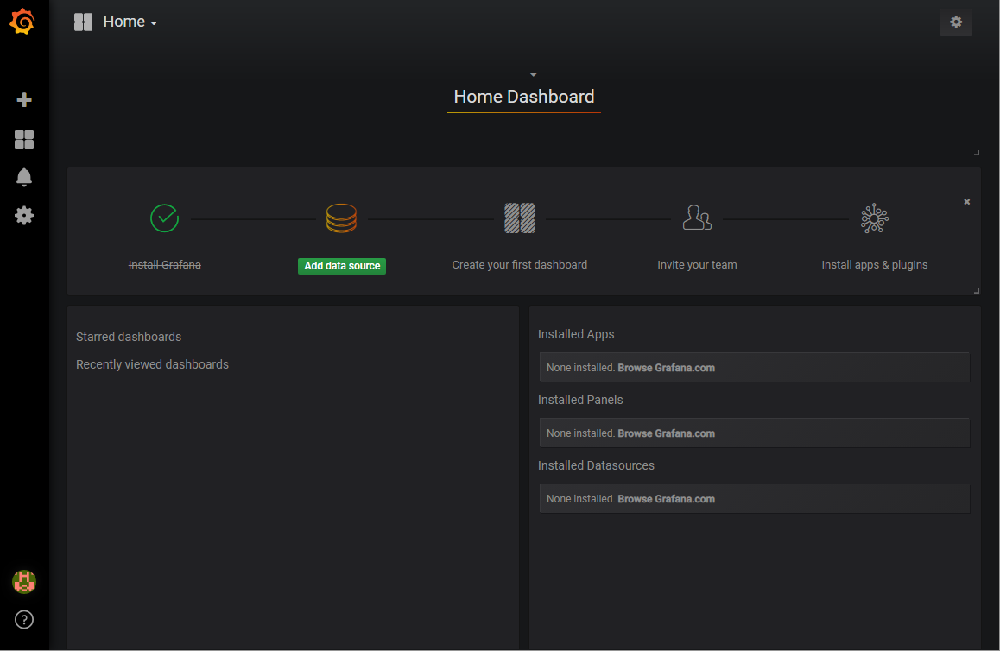

# StatsD, Graphite, and Grafana
This `docker-compose` file is designed to make it easy for Phobos users to try out [Phobos.Monitoring's StatsD integration](https://phobos.petabridge.com/articles/monitoring/backends/statsd.html) along with a user-friendly [Grafana dashboard](https://grafana.com/), which can be used to create custom charts and alerts using the data collected into [StatsD](https://github.com/etsy/statsd).

## Setup

To run this image, clone this repository and set your current working directory to this folder.

Once there and provided that you have Docker installed on your system, run the following command:

```
PS> docker-compose up -d
```

This will spin up two Docker containers:

1. StatsD &amp; Graphite - this is where metric data will be pushed by Phobos. StatsD opens its UDP endpoint on localhost:8125 and its TCP endpoint on localhost:8126 using this container. [Phobos.Monitoring.StatsD uses the UDP transport by default](https://phobos.petabridge.com/articles/monitoring/backends/statsd.html), but can be configured to use the TCP transport. The StatsD web UI will be hosted on http://localhost:8080, and this is the URL we will want to use to connect from Grafana.
2. Grafana - the Grafana dashboard UI will be bound to http://localhost:3000

Once the containers are up, login to Grafana using the following credentials (these can be changed by editing the [docker-compose.yml](docker-compose.yml) file):

1. **Username**: admin
2. **Password**: password

Once you've logged in, please click on **Add data source** so we can begin charting metrics recorded by StatsD.



You'll want to specify the following in order to connect to StatsD:

1. `Type` - Graphite;
2. `Url` - http://localhost:8080
3. `Access` - direct.

Then click on **Save &amp; Test**.

Once that's done, you'll be able to add any metrics collected by StatsD to your Grafana dashboards.